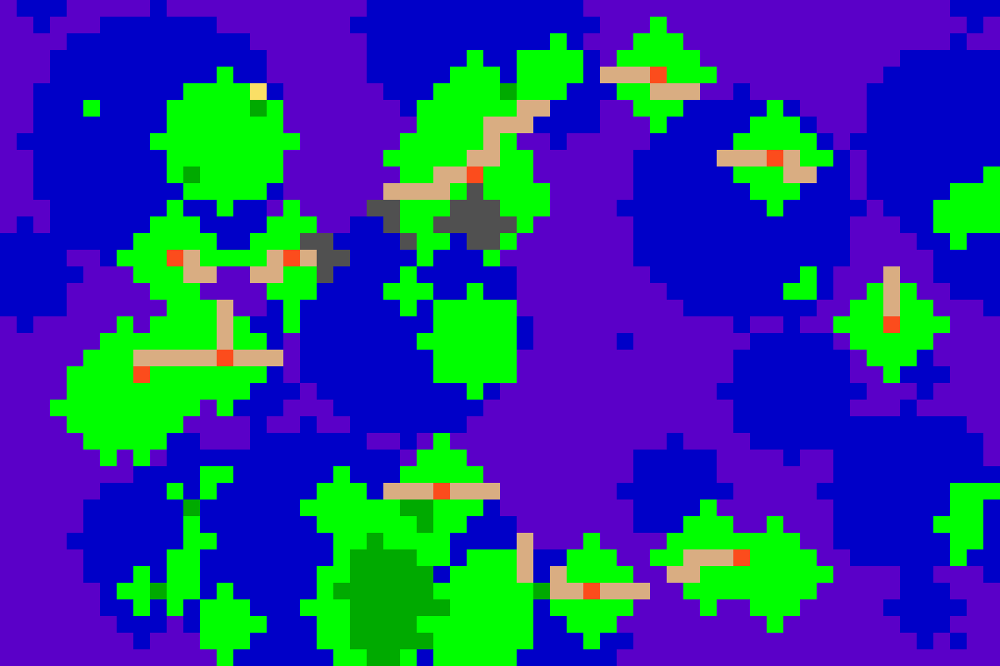
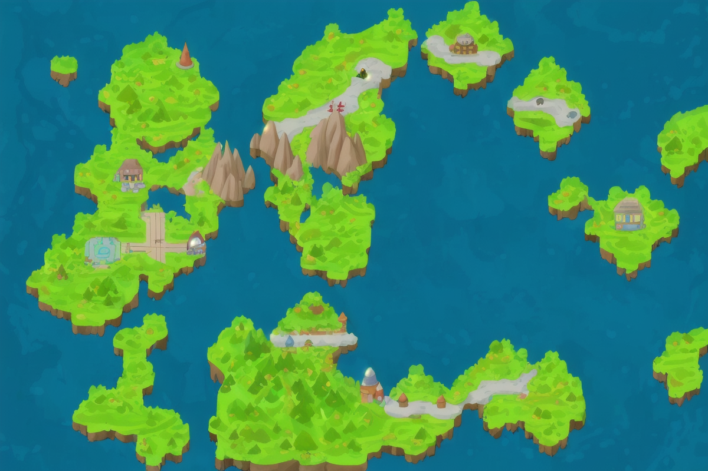

# oreore-chiho-map
自分の好きなもの・推しのキーワードリストからポケモン風の仮想世界「オレオレ地方」を生成するプログラム

以下のデータ分析手法、機械学習によく出てくる技術をふんだんに使用！（データ分析学習コンテンツとしても使えるかもしれません）

- 埋め込みモデル：キーワードのベクトル化（類似するキーワードは似た場所に集まる）
- 主成分分析：２次元の地図を描画するために次元削減
- クラスタ分析（独自）：互いに近いキーワード同士は大きな「街」としてまとめる
- 最小全域木：各クラスタ（シティ・タウン）から任意のクラスタに移動できる最小の道を構成
- Torchのモデルを使った推論（GPU）
- matplotlibによるグラフの描画
- pillowを使った画像処理
- キーワードリストから固有シードの算出：ハッシュ関数を利用
- 固有シードによる砂漠、岩地などのランダム地形の生成：入力キーワードの組み合わせが同じなら同じ地形が生成される


本プログラムで地図を生成し、Stable Diffusionで地形をリアル化したサンプル


# Get Started

## 事前準備

Python仮想環境を作成します。Jupyter Notebookで生成する場合、別途カーネルの登録が必要です。
参考記事：「Jupyter Notebook のカーネルに仮想環境をセットする方法」https://qiita.com/smiler5617/items/e0d9b3034d79457cc253

```powershell
git clone "https://github.com/keisuke-okb/oreore-chiho-map.git"
cd oreore-chiho-map
python -m venv venv
.\venv\Scripts\activate
pip install -r requirements.txt
```

## 生成手順

以下の２種類で生成を実行することができます。以下の手順を参照しながら、お好きな方の手法でお試しください。

1. Jupyter Notebookでステップバイステップ実行
  - `step1_embed.ipynb`
  - `step2_generate_oreorechiho.ipynb`
2. `python main.py`で一括実行

### 手順1. キーワードリストの作成

- `list_sample1.csv`のような形式で、改行を区切りとしてあなたの好きなもの・趣味を書き出します。
- 単語、または「●●で△△」「●●の△△」のような修飾語を入れた体言止めの説明だと埋め込みの精度が比較的良くなります。
- 以下サンプル：「休日はクラスメイトとお出かけし、平日は授業後家で動画や漫画を満喫する大学生」

```csv
車でドライブ
海岸線の散歩
山道のハイキング
漫画の一気読み
カフェ
読書
夜景スポット巡り
ラーメン食べ歩き
観光地の写真撮影
YouTube
旅動画
キャンプ用品
ゲーム実況
地元の隠れた名所探し
コーヒー豆
観光ガイドブック
音楽を聴きながらドライブ
アウトドアグッズ
小旅行の計画立て
アニメの一気見
温泉巡り
```

### 手順2. 埋め込みモデルのダウンロード

- 「multilingual-e5-large」をローカルにダウンロードし、`step1_embed.ipynb`または`main.py`にある以下の行を、ご自身のパスに変更します。
- multilingual-e5-large: https://huggingface.co/intfloat/multilingual-e5-large
- 他の埋め込みモデルに置き換える事も可能です。（埋め込みモデルによって地図は変化します）


ステップバイステップの場合：`step1_embed.ipynb`
```python
tokenizer = AutoTokenizer.from_pretrained('Z:\models\multilingual-e5-large')
model = AutoModel.from_pretrained('Z:\models\multilingual-e5-large').to("cuda:0")
```

一括実行の場合：`main.py`
```python
# 埋め込みモデルの初期化
model = embed.EmbeddingModel(model_path="Z:\models\multilingual-e5-large")
```

### 手順3. プログラムの実行

入力するキーワードリスト、埋め込みモデルのパス変更が終わったらプログラムを実行することでオレオレ地方が生成されます。

- ステップバイステップの場合は`step1_embed.ipynb`、`step2_generate_oreorechiho.ipynb`の順に上のセルから実行
- 一括実行の場合：`python main.py`を実行


# サンプル生成結果

## 休日はクラスメイトとお出かけし、平日は授業後家で動画や漫画を満喫する大学生(list_sample1.csv)

- 好きなものリスト
```csv
車でドライブ
海岸線の散歩
山道のハイキング
漫画の一気読み
カフェ
読書
夜景スポット巡り
ラーメン食べ歩き
観光地の写真撮影
YouTube
旅動画
キャンプ用品
ゲーム実況
地元の隠れた名所探し
コーヒー豆
観光ガイドブック
音楽を聴きながらドライブ
アウトドアグッズ
小旅行の計画立て
アニメの一気見
温泉巡り
```


- 次元削減結果


- ピクセル地形


- テクスチャ描画地図


- 道路


- (オプション) Stable Diffusion変換後


- 次元削減結果から各タウン・シティを命名


## 平日の仕事終わりは酒や飲み会で楽しみ、休日は小さい子供と過ごす家族の時間好きな30代のビジネスマン(list_sample2.csv)

- 好きなものリスト
```csv
仕事終わりのビール
居酒屋
飲み会
同僚との雑談
子供と一緒にプリキュア鑑賞
家族でピクニック
子供と公園遊び
動物園
水族館
ディズニーリゾート
カメラで家族写真
お弁当作り
車で近場の旅行
家族でショッピングモール
子供の成長アルバム作り
温泉旅行の計画立て
一眼レフカメラ
早朝ランニング
家族との団らん
休日ドライブ
地元イベント
```


- 次元削減結果


- ピクセル地形


- テクスチャ描画地図


- 道路


- (オプション) Stable Diffusion変換後


- 次元削減結果から各タウン・シティを命名

